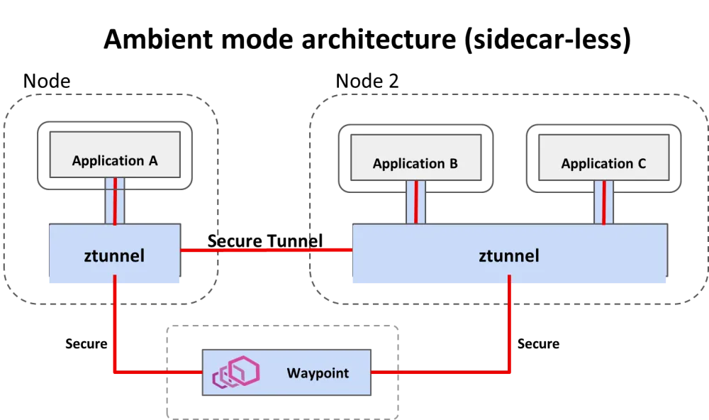

# OpenShift Service Mesh Ambient Mode - The Demo

Explore OpenShift Service Mesh - Ambient Mode, based on Istio service mesh without sidecars.

## About Ambient Mode

Istio ambient mode introduces a new way to manage service mesh without using traditional sidecar proxies. The biggest change is how it separates network traffic processing into two distinct layers, which is the core architectural difference. This architecture simplifies networking, reduces resource usage, and improves security while supporting the same service mesh use cases.

Ambient mode uses a different data plane architecture that splits traffic processing between a per-node Layer 4 (L4) proxy called Ztunnel (Zero-Trust Tunnel) and an optional Layer 7 (L7) proxy called waypoint proxy.



Ambient Mode also **exclusively uses the Kubernetes Gateway API** (using `Gateway`, `HTTPRoute`, `TCPRoute`) for its traffic configuration, moving away from Istio's legacy VirtualService and DestinationRule for L7 routing.

## 0. Prerequisites

Log in to your OpenShift environment and install the following Operators from Operator Hub:

- Kiali Operator (provided by Red Hat)
- Red Hat OpenShift Service Mesh 3
- Tempo Operator (provided by Red Hat)
- Red Hat build of OpenTelemetry (provided by Red Hat)
  
- Install the Kubernetes Gateway API: 

```sh
$ oc get crd gateways.gateway.networking.k8s.io &> /dev/null || \
  { oc apply -f https://github.com/kubernetes-sigs/gateway-api/releases/download/v1.3.0/standard-install.yaml }
```

## 1. Install OpenShift Service Mesh Ambient Mode

Navigate to the directory: `010-ambient-install` and follow the instructions.

## 2. Enable Service Mesh Observability

Red Hat OpenShift Observability provides real-time visibility, monitoring, and analysis of various system metrics, logs, and events to help you quickly diagnose and troubleshoot issues before they impact systems or applications.

Navigate to the directory: `020-observability-install` and follow the instructions.

## 3. Install the Distributed Tracing Stack (Optional)

You can integrate Red Hat OpenShift Service Mesh with Red Hat OpenShift distributed tracing data collection to instrument, generate, collect, and export OpenTelemetry traces, metrics, and logs to analyze and understand your software’s performance and behavior.

**Important!!**

If you want to see traces, you **need to enable the Waypoint Proxies (L7) for the services** you are observing, because it is not possible to see full distributed traces (with spans for each service hop) with Tempostack (Tempo/Jaeger) when your workloads are using only the L4 Ztunnel.

Navigate to the directory: `030-tracing-install` and follow the instructions.

## 4. Install the Kiali Travel demo application in ambient mesh

This demo application is based on the [Kiali Travel Demo Tutorial](https://kiali.io/docs/tutorials/travels/) and will deploy several services grouped into three namespaces. 

The Travel Demo application simulates two business domains organized in different namespaces.

- In a first namespace called **travel-portal** there will be deployed several travel shops, where users can search for and book flights, hotels, cars or insurance.
All the portals consume a service called travels deployed in the travel-agency namespace.

- A second namespace called **travel-agency** will host a set of services created to provide quotes for travel. 
A main travels service will be the business entry point for the travel agency.

- The **travel-control** namespace runs a business dashboard, that acts as a travel shop simulator and sends requests to the travel portals.

Navigate to the directory: `040-travel-demo-app` and follow the instructions.

## 5. Combining ambient and sidecar mode

Istio’s ambient mode is ideal for new mesh deployments. But it can be combined with sidecars within the same mesh.
The sidecar proxy knows to use the HBONE protocol since the destination has been discovered to be an HBONE destination.

But the combination comes with some caveats:

- Existing sidecar meshes will require an update (restart)
- Traffic between sidecars and ambient workloads will bypass waypoints, meaning only L4 features are applied.

Navigate to the directory: `050-ambient-and-sidecar` and follow the instructions.

## 6. Traffic Management

Ambient Mode provides the full suite of Istio traffic management capabilities through a two-tiered architecture that prioritizes efficiency and incremental adoption.
The key to traffic management in Ambient Mode is understanding when traffic is handled at Layer 4 (L4) versus when it is escalated to Layer 7 (L7).

- **Ztunnel**: Handles L4 (TCP) traffic management, primarily security. It provides connection-level load balancing, mTLS encryption (using HBONE), and L4 authorization. It does not read HTTP headers.
- **Waypoint Proxy**: Handles L7 (HTTP/gRPC) traffic management. This is where the advanced, application-aware features are enabled.

Navigate to the directory: `060-traffic-management` and follow the instructions.

## 7. Resilience

Upcoming module

## 8. Authentication and Authorization

Upcoming module

## 9. Troubleshooting

Upcoming module

## 10. Multicluster Ambient Mesh

Upcoming module