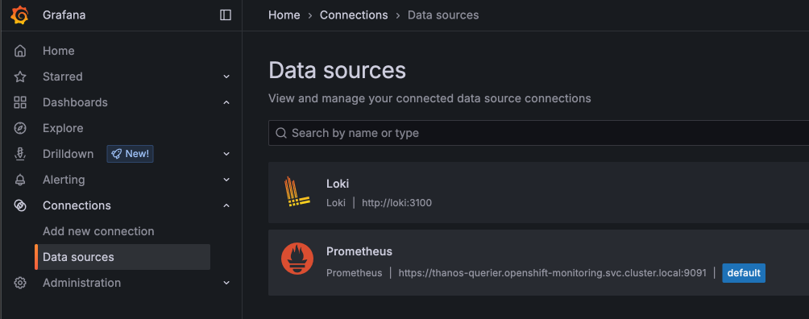
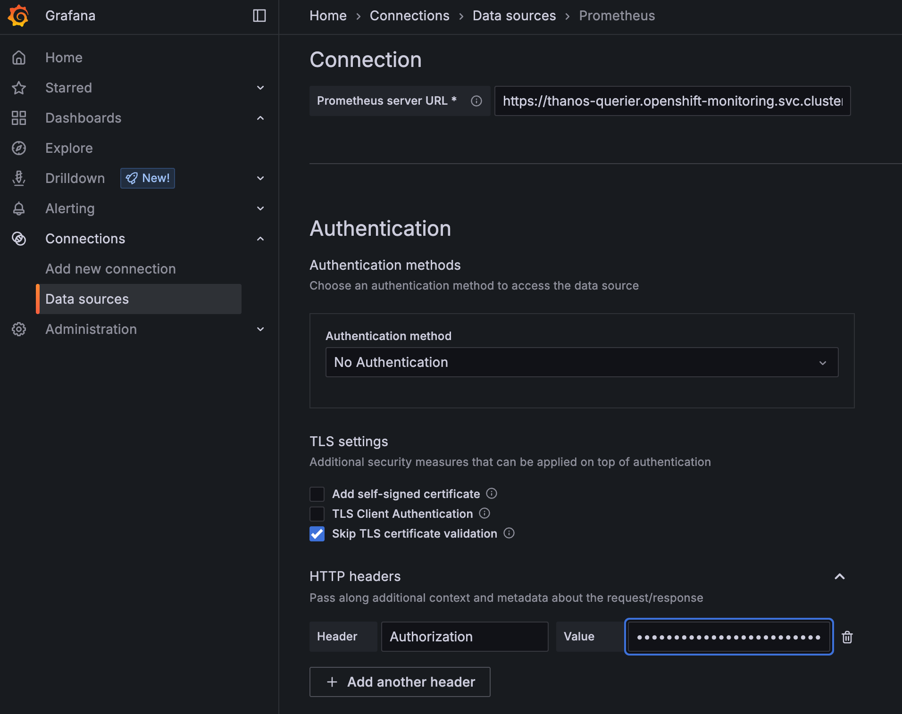
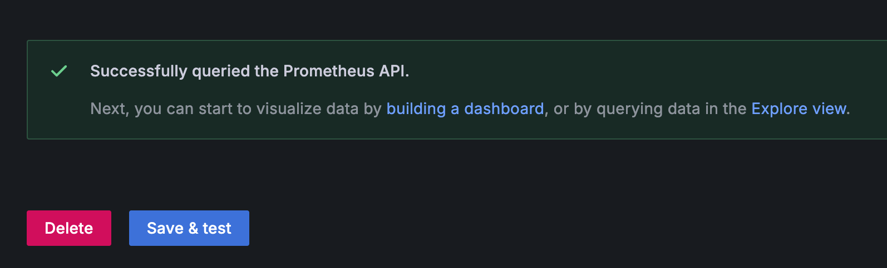
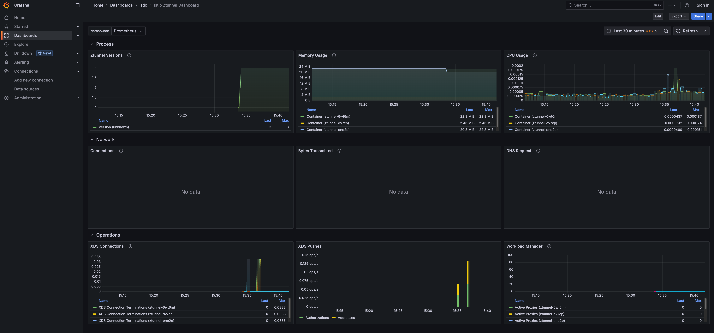
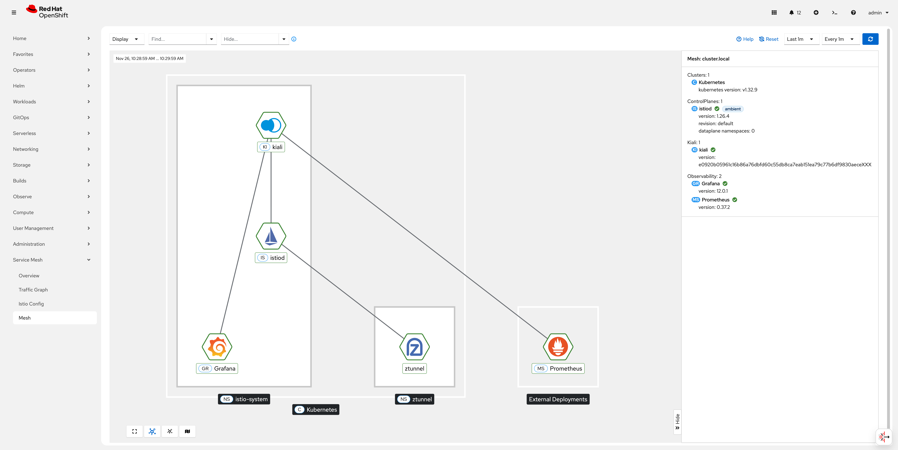

## 2. Enable Service Mesh Observability

Red Hat OpenShift Observability provides real-time visibility, monitoring, and analysis of various system metrics, logs, and events to help you quickly diagnose and troubleshoot issues before they impact systems or applications.

The two layers of ambient mesh generate different metrics:

**ztunnel** generates TCP metrics for all service traffic.

**Waypoint** proxies generates request and response metrics for HTTP, HTTP/2 and gRPC traffic.

### 2.1 Enable OpenShift user workload monitoring

You can integrate Red Hat OpenShift Service Mesh with user-workload monitoring to enable observability in your service mesh. User-workload monitoring provides access to essential built-in tools and is required to run Kiali, the dedicated console for Istio.

```sh
$ oc -n openshift-monitoring patch configmap cluster-monitoring-config -p '{"data":{"config.yaml":"enableUserWorkload: true"}}'
```

```sh
$ oc get pods -n openshift-user-workload-monitoring

NAME                                   READY   STATUS    RESTARTS   AGE
prometheus-operator-675f9d4b96-f9zxd   2/2     Running   0          8d
prometheus-user-workload-0             6/6     Running   0          8d
prometheus-user-workload-1             6/6     Running   0          8d
thanos-ruler-user-workload-0           4/4     Running   0          8d
thanos-ruler-user-workload-1           4/4     Running   0          8d
```

### 2.2 Create ServiceMonitor and PodMonitors

Change into the directory `020-observability-install`.

```sh
$ oc apply -f 02_1-service-monitor.yaml
```

```sh
$ oc apply -f 02_2-pod-monitors.yaml
```

PodMonitor objects must be applied in all mesh namespaces, including the Istio control plane namespace, because OpenShift Container Platform monitoring ignores the namespaceSelector spec in ServiceMonitor and PodMonitor objects.

### 2.3 Enable Access Logging

**Gateway and waypoint access logs** are off by default. They can be enabled using Istio’s Telemetry API.

To enable access logging for all gateways and waypoints in the mesh, create a Telemetry object in the `istio-system` namespace:

```sh
$ oc apply -f 02_3-enable-access-logging.yaml
```

### 2.4 Install a Grafana deployment

Istio comes with Grafana dashboards which offer summaries of Istio’s metrics, allowing you to drill down by service or workload.

**Step 1**: Create a Cluster role binding for the grafana and kiali service accounts, so that they have access to OpenShift Monitoring:

```sh
$ oc apply -f 03-monitoring-crb.yaml
```

**Step 2**: Install Grafana:

```sh
$ oc apply -f 04_1-grafana.yaml

serviceaccount/grafana created
configmap/grafana created
service/grafana created
deployment.apps/grafana created
configmap/istio-grafana-dashboards created
configmap/istio-services-grafana-dashboards created
```

```sh
$ oc get pods -n istio-system

NAME                       READY   STATUS    RESTARTS   AGE
grafana-6b6dfdf46c-zgr98   1/1     Running   0          37s
istiod-69b5fc4898-b7x4x    1/1     Running   0          55m
```

**Step 3**: Create an OpenShift Route for Grafana:

```sh
$ oc apply -f 04_2-grafana-route.yaml
```

**Step 4**: Create a Service Account Token for the grafana serviceaccount:

```sh
oc create token grafana -n istio-system
```

**Step 5**: Configure the Prometheus Datasource in Grafana:

Open the Grafana URL and navigate to **Connections -> Data sources**. 



Select `Prometheus` and edit the Authentication settings:

**Authentication**

Authentication Method: No Authentication

**TLS settings**

Skip TLS certificate validation

**HTTP Headers**

Header: Authorization <br/>
Value: Bearer **your-grafana-sa-token**





Navigate to **Dashboards -> Istio** and explore the available dashboards, i.e. the `Istio Ztunnel Dashboard`



### 2.5 Install Kiali

Kiali provides dashboards, observability, and robust configuration and validation capabilities. It shows the structure of your service mesh by inferring traffic topology and displays the health of your mesh. Kiali provides detailed metrics, powerful validation, access to Grafana, and strong integration with the Red Hat OpenShift distributed tracing platform (Tempo).

When running in Istio ambient mode, Kiali introduces new behaviors and visualizations to support the Ambient data plane. [Here](https://docs.redhat.com/en/documentation/red_hat_openshift_service_mesh/3.2/html/observability/kiali-operator-provided-by-red-hat#ossm-kiali-about_ossm-kiali) you find further information.

Now install the Kiali Custom Resource:

```sh
oc apply -f 05-kiali.yaml
```

When the Kiali resource is ready, get the Kiali URL from the Route by running the following command:

```sh
echo "https://$(oc get routes -n istio-system kiali -o jsonpath='{.spec.host}')"
```

Follow the URL to open Kiali in your web browser.

### 2.6 Install the OpenShift Kiali Console Plugin

The OpenShift Service Mesh Console (OSSMC) plugin extends the OpenShift Container Platform web console with a Service Mesh menu and enhanced tabs for workloads and services.

[Here](https://docs.redhat.com/en/documentation/red_hat_openshift_service_mesh/3.2/html/observability/kiali-operator-provided-by-red-hat#ossm-about-console-plugin_ossm-console-plugin) you find further information.

Now install the Service Mesh Console (OSSMC) plugin:

```sh
oc apply -f 06-ossm-console.yaml
```

The **OpenShift Console pods will restart** after a few minutes and you have to login to OpenShift again.

Verify that the Service Mesh category is added in the main OpenShift Container Platform web console navigation.

