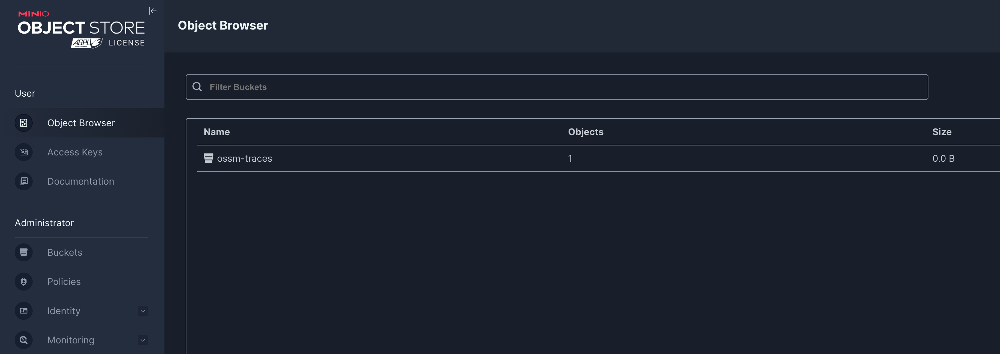

## 3. Install the Distributed Tracing Stack

You can integrate Red Hat OpenShift Service Mesh with Red Hat OpenShift distributed tracing data collection to instrument, generate, collect, and export OpenTelemetry traces, metrics, and logs to analyze and understand your software’s performance and behavior.

Please note:
- Distributed **traces are emitted from waypoint proxies only** (requires Layer 7 features)
- Kiali access traces from the waypoint proxy where the workload is enrolled
- Traces are **filtered by the trace operation** name rather than the workload name

Integrating Red Hat OpenShift distributed tracing platform with Red Hat OpenShift Service Mesh is made of up two parts: 

Installing 

- Red Hat OpenShift distributed tracing platform (Tempo) and 
- Red Hat OpenShift distributed tracing data collection.


### 3.0 Prerequisites

Make sure you have installed the following operators:

- Tempo Operator (provided by Red Hat)
- Red Hat build of OpenTelemetry (provided by Red Hat)
  
### 3.1 Installing MinIO Object storage

Object storage is required and not included with the Distributed Tracing Platform. You must choose and set up object storage by a supported provider before installing the Distributed Tracing Platform. 

We are going to install MinIO for this demo:

Change into the directory `030-tracing-install`.

```sh
$ oc apply -f ./00-minio/

namespace/minio created
secret/minio-secret created
persistentvolumeclaim/minio-pvc created
deployment.apps/minio created
service/minio-service created
route.route.openshift.io/minio-api created
route.route.openshift.io/minio-ui created
job.batch/create-minio-buckets created
```

When MinIO is ready, get the MinIO UI URL from the Route by running the following command:

```sh
echo "https://$(oc get routes -n minio minio-ui -o jsonpath='{.spec.host}')"
```

Open the URL and login with the **user**: `minio` and **password**: `minio123`



### 3.2 Create the namespace for the Tempo Stack deployment

```sh
$ oc apply -f 01-namespace.yaml
```

### 3.3 Create a MinIO access for Tempo Stack

```sh
$ oc apply -f 02-minio-secret.yaml
```

### 3.4 Deploy a Tempo Stack instance

This CR creates a simple TempoStack deployment, that exposes the Jaeger UI, which visualizes the data, via a route and uses our MinIO instance for storage of tracing data.

```sh
$ oc apply -f 03-tempostack.yaml
```

Verify that the status of all TempoStack components is Running and the conditions are type: Ready by running the following command:

```sh
$ oc get tempostacks.tempo.grafana.com simplest -n tempostack -o yaml
```

Verify that all the TempoStack component pods are running by running the following command:

```sh
$ oc get pods -n tempostack

NAME                                             READY   STATUS    RESTARTS   AGE
tempo-simplest-compactor-6bb589bdf5-5dxv6        1/1     Running   0          4m19s
tempo-simplest-distributor-7c7bcc457c-cctr7      1/1     Running   0          4m20s
tempo-simplest-ingester-0                        1/1     Running   0          4m20s
tempo-simplest-querier-69f46cf4b7-zdrb7          1/1     Running   0          4m20s
tempo-simplest-query-frontend-6bdf9c49c9-twflm   4/4     Running   0          4m20s
```

Get the Query Frontend URL from the Route by running the following command:

```sh
echo "https://$(oc get routes -n tempostack tempo-simplest-query-frontend -o jsonpath='{.spec.host}')"
```

Follow the URL to open the Jeager Dashboard in your web browser.

### 3.5 Install the OpenTelemetryCollector

Next, install the `OpenTelemetryCollector` resource in the istio-system namespace.
This collector will receive traces from Istio and will export them through GRPC to Tempo.

```sh
$ oc apply -f 04-otel-collector.yaml
```

```sh
$ oc get pods -n istio-system

NAME                              READY   STATUS    RESTARTS   AGE
grafana-6b6dfdf46c-zgr98          1/1     Running   0          19h
istiod-69b5fc4898-b7x4x           1/1     Running   0          19h
kiali-686d9b5f68-j5x8z            1/1     Running   0          73m
ossmconsole-74bdffdfd7-xv56c      1/1     Running   0          64m
otel-collector-59798f79d4-gcjxf   1/1     Running   0          82s
```

### 3.6 Configure Tracing in Service Mesh

Configure Red Hat OpenShift Service Mesh to enable tracing, and define the distributed tracing data collection tracing providers in your meshConfig:

```sh
$ oc apply -f 05-istio-update.yaml
```