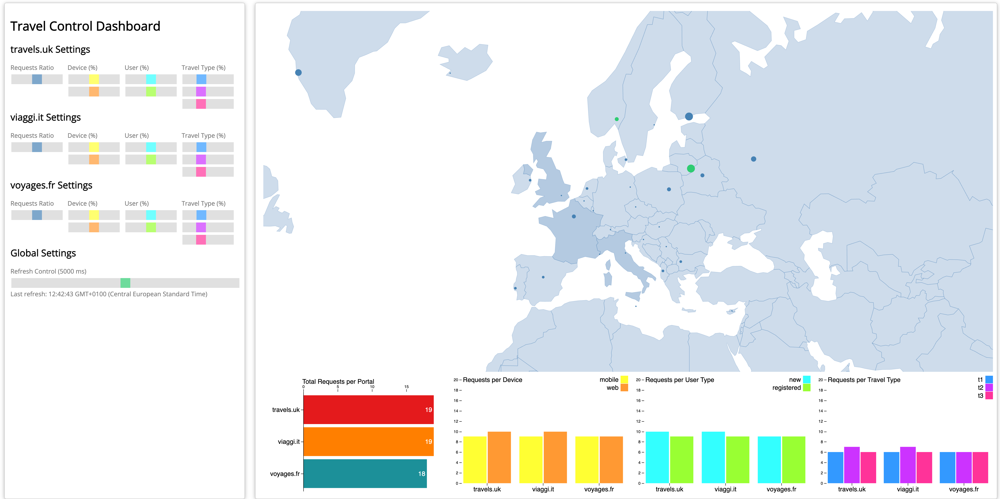
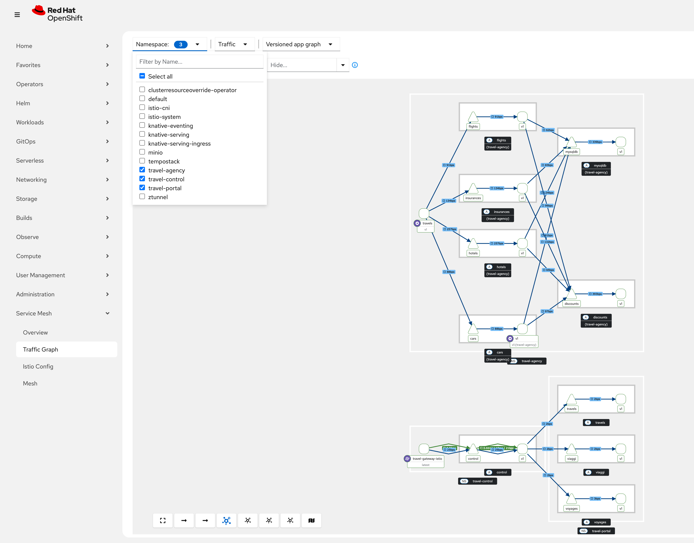
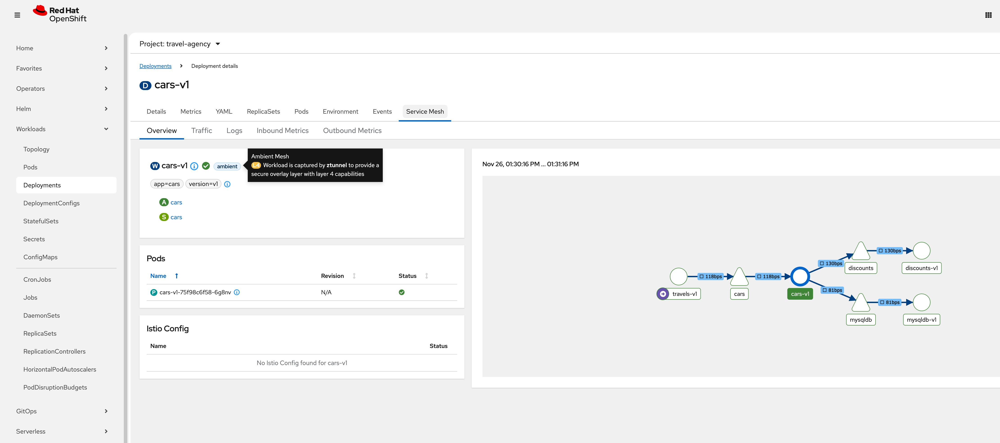
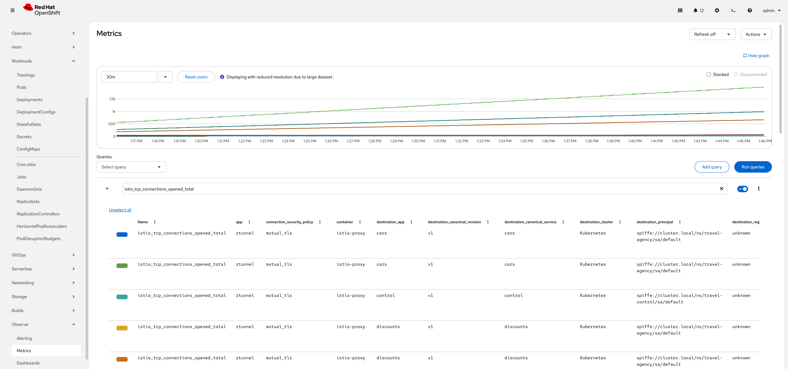

## 4. Install the Kiali Travel demo application

This demo application is based on the [Kiali Travel Demo Tutorial](https://kiali.io/docs/tutorials/travels/) and will deploy several services grouped into three namespaces. 

### 4.1 Create the namespaces

Change into the directory `040-travel-demo-app`.

Create the namespaces for the Kiali Travel Demo with the following command:

```sh
$ oc apply -f 01_1-ns-create.yaml
```

The namespaces are labeled with the configured istio discovery selector.

### 4.2 Create pod monitors

PodMonitor objects must be applied in all mesh namespaces:

```sh
$ oc apply -f 01_2-pod-monitors-create.yaml
```

### 4.3 Deploy the application components

**Step 1**: Deploy the `travel-agency` components with: 

```sh
$ oc apply -n travel-agency -f 02_1-travel-agency-app.yaml

secret/mysql-credentials created
service/mysqldb created
deployment.apps/mysqldb-v1 created
deployment.apps/cars-v1 created
service/cars created
deployment.apps/discounts-v1 created
service/discounts created
deployment.apps/flights-v1 created
service/flights created
deployment.apps/hotels-v1 created
service/hotels created
deployment.apps/insurances-v1 created
service/insurances created
deployment.apps/travels-v1 created
service/travels created
```

**Step 2**: Deploy the `travel-portal` components with: 

```sh
$ oc apply -n travel-portal -f 02_2-travel-portal-app.yaml

deployment.apps/voyages created
service/voyages created
deployment.apps/viaggi created
service/viaggi created
deployment.apps/travels created
service/travels created
```

**Step 3**: Deploy the `travel-control` components with: 

```sh
$ oc apply -n travel-control -f 02_3-travel-control-app.yaml

deployment.apps/control created
service/control created
```

**Step 4**: Create a Route for the `Travel Control Dashboard` with: 

```sh
$ oc apply -f 02_4-travel-control-route.yaml
```

Get the Travel Control Dashboard URL from the Route by running the following command:

```sh
echo "https://$(oc get routes -n travel-control route-travel-control -o jsonpath='{.spec.host}')"
```

Open the Dashboard and verify everything is working.  



### 4.4 Add the application to the Ambient Mesh

**Important!!**

Right now, we have deployed the application components in namespaces, that are "visible" to the Istio control plane (due to discoverySelectors), but the application pods are not enrolled in the data plane.  The application is treated as a standard Kubernetes workload. Even though Istio "knows" about the service, it knows that the specific pod does not have a proxy (ztunnel or sidecar) attached to it.

We can verify this by the following command:

```sh
$ istioctl ztunnel-config workload -n ztunnel

NAMESPACE      POD NAME                        ADDRESS      NODE     WAYPOINT PROTOCOL
travel-agency  cars-v1-75f98c6f58-6g8nv        10.130.1.114 master-0 None     TCP
travel-agency  discounts-v1-6dccdff9ff-dwflq   10.130.1.116 master-0 None     TCP
travel-agency  flights-v1-6b7b99b764-g44mc     10.130.1.117 master-0 None     TCP
travel-agency  hotels-v1-6bcc9b877d-bhbrq      10.129.1.105 master-1 None     TCP
travel-agency  insurances-v1-75cb48b577-nszkq  10.129.1.106 master-1 None     TCP
travel-agency  mysqldb-v1-6657d57779-frcfj     10.130.1.115 master-0 None     TCP
travel-agency  travels-v1-56895446c5-l6qmm     10.128.0.117 master-2 None     TCP
travel-control control-6474d4c775-qt288        10.129.1.107 master-1 None     TCP
travel-portal  travels-6684f75cd5-lfd9m        10.130.1.119 master-0 None     TCP
travel-portal  viaggi-59988c897c-blffl         10.130.1.118 master-0 None     TCP
travel-portal  voyages-6c86bcdb5d-4zfzd        10.128.0.118 master-2 None     TCP
```

Key columns to watch:

PROTOCOL:

- HBONE: The workload is part of the Ambient Mesh (mTLS enabled).
- TCP: The workload is not in the mesh (not part of the dataplane).

WAYPOINT: 

- Shows if there is a Layer 7 Waypoint proxy enforcing policy for that workload.

Now let's add the application to the Ambient Mesh by labeling the namespaces with `istio.io/dataplane-mode=ambient`:

```sh
$ oc apply -f 03-ns-add-to-mesh.yaml
```

Verify that the application is now part of the Mesh:

```sh
$ istioctl ztunnel-config workload -n ztunnel

NAMESPACE      POD NAME                        ADDRESS      NODE     WAYPOINT PROTOCOL
travel-agency  cars-v1-75f98c6f58-6g8nv        10.130.1.114 master-0 None     HBONE
travel-agency  discounts-v1-6dccdff9ff-dwflq   10.130.1.116 master-0 None     HBONE
travel-agency  flights-v1-6b7b99b764-g44mc     10.130.1.117 master-0 None     HBONE
travel-agency  hotels-v1-6bcc9b877d-bhbrq      10.129.1.105 master-1 None     HBONE
travel-agency  insurances-v1-75cb48b577-nszkq  10.129.1.106 master-1 None     HBONE
travel-agency  mysqldb-v1-6657d57779-frcfj     10.130.1.115 master-0 None     HBONE
travel-agency  travels-v1-56895446c5-l6qmm     10.128.0.117 master-2 None     HBONE
travel-control control-6474d4c775-qt288        10.129.1.107 master-1 None     HBONE
travel-portal  travels-6684f75cd5-lfd9m        10.130.1.119 master-0 None     HBONE
travel-portal  viaggi-59988c897c-blffl         10.130.1.118 master-0 None     HBONE
travel-portal  voyages-6c86bcdb5d-4zfzd        10.128.0.118 master-2 None     HBONE
```

HBONE stands for HTTP-Based Overlay Network Environment. 
It is the custom tunneling protocol Istio Ambient Mesh uses to transport traffic securely between nodes (Ztunnels) and Waypoint proxies.

After the label is applied, all L4 traffic to and from the ambient mesh is intercepted and secured via mutual TLS (mTLS) by the ztunnel. No further configuration is required and also no restart of the workloads.

Congratulations! You have successfully added the Travel Demo to ambient mesh.

### 4.5 Create an Ingress Gateway

The following configuration is defining a basic `Ingress Gateway` and an `HTTPRoute` using the Kubernetes Gateway API, which Istio fully supports and implements. It's essentially setting up a public entry point for HTTP traffic and routing all incoming requests to the control service.

```sh
$ oc apply -f 04-ingress-gateway-create.yaml
```

Expose the Ingress Gateway with an OpenShift Route:

```sh
$ oc apply -f 05-ingress-gateway-route.yaml
```

You can now access the Travel Control Dashboard through the Service Mesh Ingress Gateway:

```sh
echo "https://$(oc get routes -n travel-control travel-gateway -o jsonpath='{.spec.host}')"
```

### 4.6 Observe the Travel Demo application

Go to Kiali or use the Service Mesh Console plugin to observe the traffic of the Travel Demo application. Navigate to **Service Mesh -> Traffic Graph**, select the 3 travel demo namespaces and have a look at the `Versioned app graph`



In the OpenShift Console, select the travel-agency project and navigate to **Workloads -> Deployments**. Select .i.e the cars-v1 deployment and click on the `Service Mesh` tab:



In the OpenShift Console, go to Observe -> Metrics and run the query: `istio_tcp_connections_opened_total` to verify that ztunnel uses mTLS:



### 4.7 Apply an Authorization policy

The following policy is an Istio `AuthorizationPolicy` that specifically defines which traffic is allowed to reach the workloads labeled `app: control` in the travel-control namespace.

It basically creates a security rule that **ensures only traffic originating from the Istio Gateway deployment can reach the control** application. 

This is a Level 4 policy that is enforced by ztunnel.

```sh
$ oc apply -f 06-gw-auth-policy.yaml
```

Verify that it is not possible to access the `control` service from another pod with the command:

```sh
oc exec $(oc get pod -l app=cars -n travel-agency -o jsonpath='{.items[0].metadata.name}') -n travel-agency -- curl -sS control.travel-control.svc.cluster.local:8080

curl: (56) Recv failure: Connection reset by peer
command terminated with exit code 56
  ```