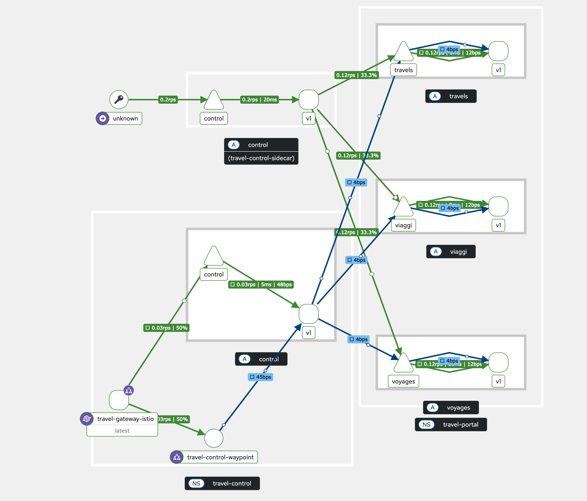

## 5. Combining ambient and sidecar mode

Istio’s ambient mode is ideal for new mesh deployments. But it can be combined with sidecars, with caveats:
- Existing sidecar meshes will require an update (restart)
- Traffic between sidecars and ambient workloads will bypass waypoints, meaning only L4 features are applied.

**Recommendation: Keep ambient and sidecar meshes in separate namespaces.**

### 5.0 About this module

In this module we are going to combine our existing ...

### 5.1 Create the namespace

Change into the directory `050-ambient-and-sidecar`.

Create the namespace `travel-control-sidecar` with the following command:

```sh
oc apply -f 01-ns-create.yaml
```

The namespace is labeled with the configured istio discovery selector `istio-discovery=enabled` and the injection label `istio-injection=enabled`. 
Istio will inject sidecars for workloads in this namespace.

### 5.2 Create pod monitors

PodMonitor objects must be applied in all mesh namespaces:

```sh
oc apply -f 02-pod-monitors-create.yaml
```

### 5.3 Deploy the travel-control application component

This time we deploy the same Travel control dashboard with sidecar injection.

Istio docs says:

For sidecar proxies to use the HBONE/mTLS signaling option when communicating with ambient destinations, they need to be configured with ISTIO_META_ENABLE_HBONE set to true in the proxy metadata. 

Therefore the travel control deployment YAML has the following annotation:

```yaml
spec:
  template:
    metadata:
      annotations:
        proxy.istio.io/config: |
          proxyMetadata:
            ISTIO_META_ENABLE_HBONE: "true"
```

**Step 1**: Let's apply the travel control deployment and service now:

```sh
oc apply -f 03-travel-control-app.yaml

deployment.apps/control created
service/control created
```

Check if we have two containers running in the pod:

```sh
oc get pods -n travel-control-sidecar -o jsonpath="{.items[*].spec.containers[*].name}"

control istio-proxy
```

**Step 2**: Create a Route for this new `Travel Control Dashboard` with: 

```sh
oc apply -f 04-travel-control-route.yaml
```

Get the Travel Control Dashboard URL from the Route by running the following command:

```sh
echo "https://$(oc get routes -n travel-control-sidecar control-sidecar -o jsonpath='{.spec.host}')"
```

Open the Dashboard and verify it is working.


