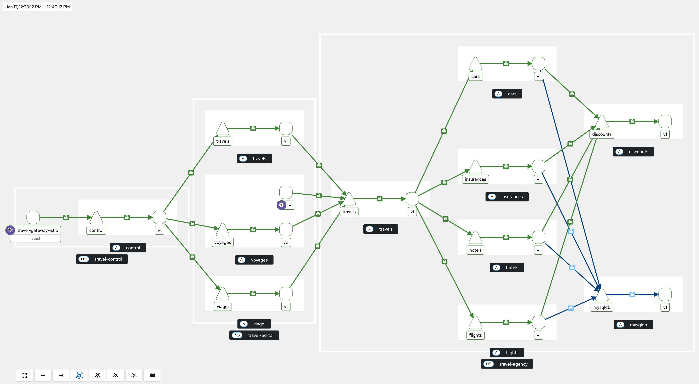
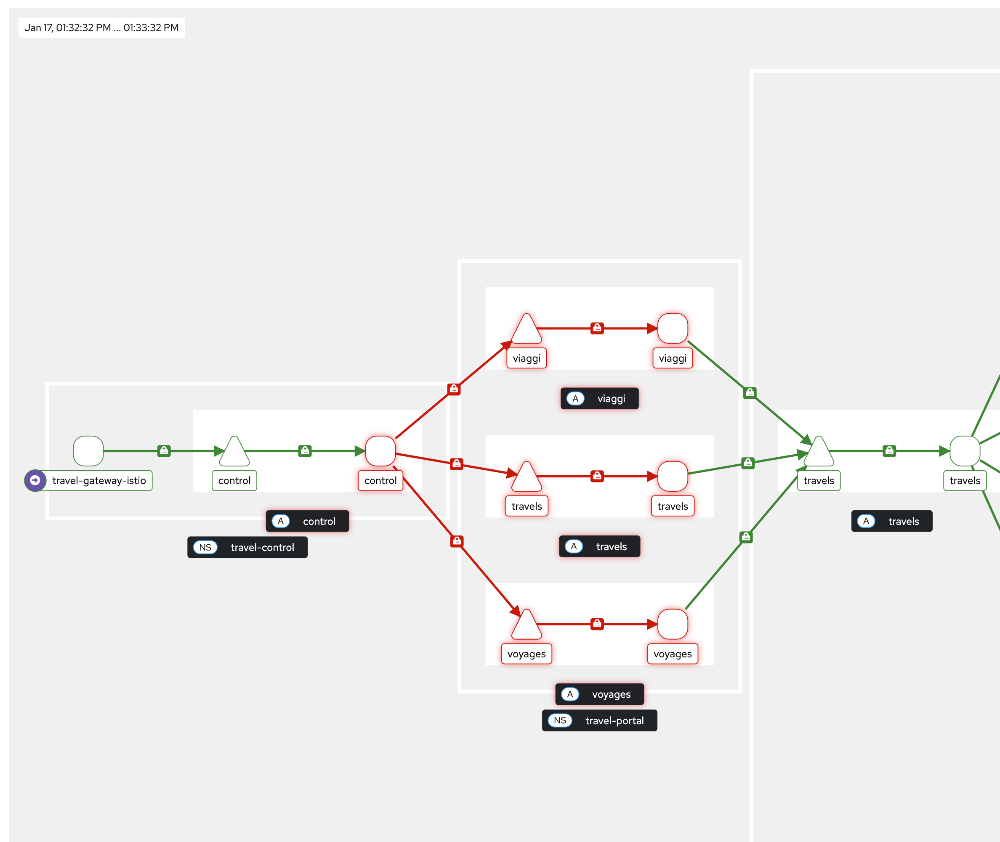

## 8. Authentication and Authorization

In this module we focus on **Authentication and Authorization**: making sure that only trusted workloads can communicate, and that they are only allowed to do what they are supposed to do. In a microservices architecture, security is no longer just about protecting the edge of the system. Every service-to-service call is a potential attack surface and must be secured.

Authentication answers the question: *Who are you?*
Authorization answers the question: *What are you allowed to do?*

They are important because they:

* Protect services from unauthorized access
* Enable zero-trust networking inside the cluster
* Reduce the blast radius of compromised services
* Make security consistent and centrally managed
* Simplify application code by offloading security to the platform

Istio provides strong, built-in security capabilities at the service mesh level:

* **mTLS (Mutual TLS)**: Automatically encrypts traffic and authenticates workloads using identities
* **Workload identity**: Each service gets a cryptographic identity based on its service account
* **Peer authentication**: Control how services authenticate each other (strict, permissive, disabled)
* **Request authentication**: Validate JWT tokens for end-user or external identity providers
* **Authorization policies**: Fine-grained access control based on identity, namespace, paths, methods, headers, and claims
* **Default deny policies**: Implement zero-trust by blocking all traffic unless explicitly allowed
* **Centralized enforcement**: Security rules are enforced consistently without changing application code

With Istio, authentication and authorization become infrastructure concerns rather than application concerns. This module will show how to secure service-to-service communication and APIs in a uniform, declarative, and production-ready way.

### 7.1 Enforcing mTLS with Peer Authentication

`PeerAuthentication` is how you tell Istio how strictly services must use mTLS when talking to each other.
When you set it to STRICT, you are saying:
“Only accept traffic that is encrypted and mutually authenticated with mTLS.”

**IMPORTANT**: Sidecar mTLS and ztunnel HBONE handle mTLS handshakes etc. in a different way!!
When you set mTLS mode to STRICT, the services in a namespace have to negotiate and agree on ONE specific mTLS mode, therefore STRICT mode won't work if you have sidecar workloads and ambient workloads in the SAME namespace. 
In this case you should use PERMISSIVE mode.

Now let's enforce mTLS for the whole mesh by applying:

```yaml
apiVersion: security.istio.io/v1
kind: PeerAuthentication
metadata:
  name: mtls-default-strict-policy
  namespace: istio-system
spec:
  mtls:
    mode: STRICT
```

```sh
oc apply -f 01-mtls-default-strict-policy.yaml
```

Validate your travel application is still working by looking at:
- Kiali - Traffic Dashboard
- Travel Demo Business Dashboard - The application UI

But your Travel Demo Business Dashboard in the `travel-control-sidecar` namespace isn't working anymore. 

**Why is that??**

### 7.2 Validate mTLS in Ambient Mode

Ambient mode provides strong workload-to-workload authentication by default using mTLS, without sidecars.
In Ambient, authentication is handled by the ztunnel layer:
- Every workload gets a cryptographic identity (based on its Kubernetes ServiceAccount)
- All traffic between workloads is automatically: Encrypted, Authenticated, Verified using mutual TLS (mTLS)

You can validate that by:

- In the OpenShift console, you can look at the metrics for your traffic (Click Observe -> Metrics): `istio_tcp_connections_opened_total`, `istio_tcp_connections_closed_total`, `istio_tcp_received_bytes_total`, `istio_tcp_sent_bytes_total`

- Use Kiali Dashboard (Traffic Graph -> Enable Security in the display options)



- Validate `HBONE` protocol is being used with the command `istioctl ztunnel-config workloads -n ztunnel`
- Looking at the `ztunnel` logs, making sure identities are being used for source and destination

### 7.3 Create a Level 4 Authorization Policy

The following policy allows only the travel-control service to call the viaggi service.

In simple terms:

- It applies to pods labeled app: viaggi in the travel-portal namespace.
- It allows requests coming from the service account: `cluster.local/ns/travel-control/sa/default
`
- Once this ALLOW policy exists, all other sources are implicitly denied.

The viaggi service only accepts traffic from the travel-control namespace’s default service account. Everyone else is blocked.

This is a Level 4 policy that is enforced by ztunnel.

```yaml
apiVersion: security.istio.io/v1
kind: AuthorizationPolicy
metadata:
  name: travel-api-control-allow
  namespace: travel-portal
spec:
  selector:
    matchLabels:
      app: viaggi
  action: ALLOW
  rules:
  - from:
    - source:
        principals:
        - cluster.local/ns/travel-control/sa/default  
 
```

```sh
oc apply -f 02-auth-policy.yaml
```

Check if the policy was attached to ztunnel:

```sh
oc get ap travel-api-control-allow -n travel-portal -o yaml
```

```
status:
  conditions:
  - lastTransitionTime: "2026-01-09T12:04:50.952399869Z"
    message: attached to ztunnel
    observedGeneration: "1"
    reason: Accepted
    status: "True"
    type: ZtunnelAccepted
```

You can also verify that it is not possible to access the `viaggi` service from another pod with the command:

```sh
oc exec $(oc get pod -l app=cars -n travel-agency -o jsonpath='{.items[0].metadata.name}') -n travel-agency -- curl -sSv http://viaggi.travel-portal.svc.cluster.local:8000/status
```

```
*   Trying 172.30.125.155...
* Connected to viaggi.travel-portal.svc.cluster.local (172.30.125.155) port 8000 (#0)
> GET /status HTTP/1.1
> User-Agent: curl/7.29.0
> Host: viaggi.travel-portal.svc.cluster.local:8000
> Accept: */*
> 
upstream connect error or disconnect/reset before headers. reset reason: connection termination< HTTP/1.1 503 Service Unavailable
```

### 7.4 Create a Level 7 Authorization policy

The following policy is an Istio `AuthorizationPolicy` that defines that the travels service only accepts HTTP `GET` requests and only if they come from the
`travel-portal` namespace using the `default` service account.
**Everything else is denied.**

So it enforces two conditions at the same time:

- Correct identity (who is calling)
- Correct operation (what they are allowed to do)

This is a Level 7 policy that is enforced by the waypoint proxy.

```yaml
apiVersion: security.istio.io/v1
kind: AuthorizationPolicy
metadata:
  name: allow-get-from-travel-portals
  namespace: travel-agency
spec:
  targetRefs:
  - kind: Service
    group: ""
    name: travels
  action: ALLOW
  rules:
  - from:
    - source:
        principals:
        - cluster.local/ns/travel-portal/sa/default
    to:
    - operation:
        methods: ["GET"]  
```

```sh
oc apply -f 03-travel-api-get-policy.yaml
```

The traffic flow looks like this:

```
caller pod
  ↓
ztunnel (mTLS + identity)
  ↓
waypoint-travel-agency  ← AuthorizationPolicy enforced here (L7)
  ↓
travels service

```
Check if the policy was attached to the waypoint proxy:

```sh
oc get ap allow-get-from-travel-portals -n travel-agency -o yaml
```

```
status:
  conditions:
  - lastTransitionTime: "2026-01-19T08:46:06.875184153Z"
    message: bound to travel-agency/waypoint-travel-agency
    observedGeneration: "1"
    reason: Accepted
    status: "True"
    type: WaypointAccepted
```

Verify that it is not possible to access the `travels` service from another pod with the command:

```sh
oc exec $(oc get pod -l app=cars -n travel-agency -o jsonpath='{.items[0].metadata.name}') -n travel-agency -- curl -sSv travels.travel-agency.svc.cluster.local:8000/travels/Madrid
```

```
*   Trying 172.30.150.117...
* Connected to travels.travel-agency.svc.cluster.local (172.30.150.117) port 8000 (#0)
> GET /travels/Madrid HTTP/1.1
> User-Agent: curl/7.29.0
> Host: travels.travel-agency.svc.cluster.local:8000
> Accept: */*
> 
RBAC: access denied< HTTP/1.1 403 Forbidden
  ```

### 7.5 DENY ALL policy (Optional Challenge)

In this step we are going to apply a `deny all` policy for the travel-portal namespace, and you need to figure out the necessary `ALLOW` policies to make everything work again.

In this case, “deny all traffic in a namespace” means denying everything that goes through the namespace’s waypoint.

So effectively:

- No service in travel-portal can be called
- Services in travel-portal cannot call anything else
- Until you add explicit ALLOW policies, the namespace is completely locked down at L7

```
anything → ztunnel → waypoint-travel-portal → ❌ DENIED
```

Now, let's apply the policy:

```yaml
apiVersion: security.istio.io/v1
kind: AuthorizationPolicy
metadata:
  name: travel-portal-deny-all
  namespace: travel-portal
spec:
  targetRefs:
  - kind: Gateway
    group: gateway.networking.k8s.io
    name: waypoint-travel-portal
  action: DENY
  rules:
  - {}
```

```sh
oc apply -f 04-deny-all-default-policy.yaml
```



Important to remember:

- This is enforced at the waypoint proxy (L7)
- mTLS and identity still exist at ztunnel (L4)
- Only blocks traffic that is routed through that waypoint. It does not block direct ztunnel → workload traffic.

Now figure out the right `ALLOW` policies to make the travel application work again. And have fun!!